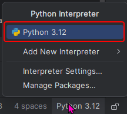
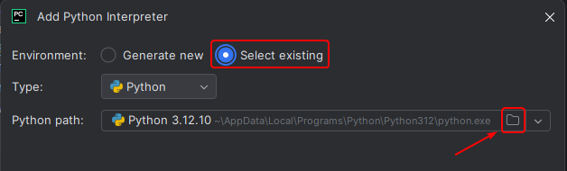
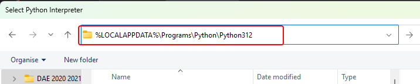
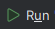
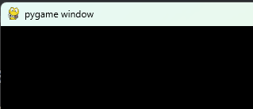

```text                                        
.______   .______        ______     _______  _______    ___      __  
|   _  \  |   _  \      /  __  \   /  _____||   ____|  /   \    /_ | 
|  |_)  | |  |_)  |    |  |  |  | |  |  __  |  |__    /  ^  \    | | 
|   ___/  |      /     |  |  |  | |  | |_ | |   __|  /  /_\  \   | | 
|  |      |  |\  \----.|  `--'  | |  |__| | |  |    /  _____  \  | | 
| _|      | _| `._____| \______/   \______| |__|   /__/     \__\ |_|                                                                                                                                                                                                                                                                   
```                                                                              
# Welcome to PROGFA1
**Installed on:** 2025-09-21 21:48:30  
**Version:** 1.2.1  
**Project path:** C:\Users\anna-\Documents\_HOWEST\Jaar1\PROGFA\PROGFA1  
## ⚠️ Final Setup Required
> If you see this README right after installing, please follow the steps below to finalise your setup!
### ✅ Set your Python Interpreter
To make sure your project runs correctly in PyCharm:
1. Look in the **bottom-right corner** of this window.
2. Click the **Python interpreter** dropdown (your content may look different):
3. Choose your installed Python version (e.g. Python 3.12.x).  

   > <span style="color: orangered;">**⚠️ Is Python not in your list?**</span>  
   > 
   > ONLY IF Pyhon 3.12 (or any other Python version) is not in the list above,  
   > choose:  <span style="color: orange;">Add New Interpreter > Add Local Interpreter...</span>
   >   
   > In the window that appears, paste the following cmd: <span style="color: orange;">%LOCALAPPDATA%\Programs\Python\Python312</span>  
   > 
   >
   > Finally, double-click <span style="color: orange;">python.exe</span> and click <span style="color: orange;">OK</span>
   

### ✅ Start your coding journey
1. On the left, go to the folder <span style="color: orange;">L00 Install</span>.
2. Right-click the file <span style="color: orange;">start_journey.py</span> and choose 
3. You should see a yellow message appear in the bottom of this window. <span style="color: yellow;">Happy coding!</span>  
  
> ⚠️ <span style="color: orangered;">If you cannot run this</span>, contact your lab teachers ASAP via email or during the lab!
### ✅ Get your engines running
1. Right click on the folder L00_install.
2. Choose **New >**  
3. Name it <span style="color: orange;">start_your_engine.py</span>
4. Right-click the <span style="color: orange;">start_your_engine.py</span> file and choose 
5. You should see a black window appear with title 'pygame window':    

> ⚠️ <span style="color: orangered;">If you cannot run this</span>, contact your lab teachers ASAP via email or during the lab!
